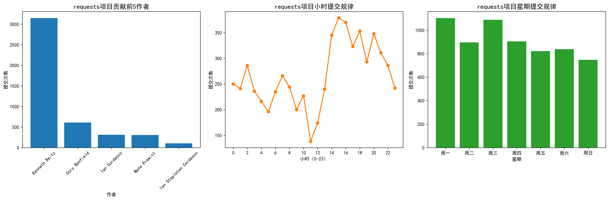

# 开源软件基础大作业-Requests项目提交历史分析与规律挖掘
## 作者信息
- 组长：毛谦韵（学号：20232241235，github：AderoseYR）
- 组员：徐昊天（学号：20232241218，github：lingo12321）
- 提交日期：2025年02月13日

## 摘要
本次开源软件基础大作业以Python知名开源项目Requests为研究对象，借助GitPython、Pandas、Matplotlib等开源工具/类库，提取Requests项目Git仓库的提交历史数据，对提交作者、提交时间、修改文件数等核心维度进行统计分析与可视化挖掘。通过本次作业，实现了开源Git仓库的数据分析能力，掌握了开源工具的实际应用，同时挖掘出Requests项目的开发提交规律，完成了开源软件仓库规律分析的核心任务。本次作业所有代码均基于开源软件实现，符合课程考核要求。

**关键词**：开源软件；Git仓库；提交历史分析；Requests；数据可视化

## 一、需求分析
### 1.1 作业背景
开源软件是现代软件开发的核心组成部分，分析开源软件仓库的提交规律与演化特点，是开源软件基础课程的核心学习目标。本次作业选取Python生态中最流行的HTTP库Requests为研究对象，通过对其仓库提交历史的分析，掌握开源工具的使用方法，理解开源项目的开发协作模式。

### 1.2 功能需求
1. 能够从本地Git仓库中提取Requests项目的所有提交历史数据，包括提交ID、作者、提交时间、修改文件数等核心信息；
2. 对提取的原始数据进行清洗与统计，分析核心指标（如贡献度前5的作者、提交时间规律等）；
3. 将统计结果通过可视化图表呈现，直观展示开源项目的提交规律；
4. 将统计数据保存为CSV文件，方便后续查看与验证。

### 1.3 技术需求
1. 基于开源软件/类库实现，禁止使用闭源工具；
2. 代码可运行，且能在不同系统（Windows/Mac/Linux）上兼容；
3. 生成的可视化图表为高分辨率，可用于作业文档展示；
4. 所有代码提交至GitHub仓库，支持版本管理与团队协作。

### 1.4 非功能需求
1. 代码结构清晰，加详细注释，便于阅读与维护；
2. 运行效率高，能快速处理Requests仓库的提交数据；
3. 文档规范，贴合毕业设计章节结构，涵盖所有核心环节。

## 二、系统设计
### 2.1 整体架构设计
本次作业的系统整体分为**3个核心模块**，模块之间采用线性执行流程，数据从仓库提取后，依次经过清洗统计、可视化，最终生成成果文件，整体架构如下：
```
Git仓库数据提取模块 → 数据清洗与统计模块 → 数据可视化模块
        ↓               ↓                  ↓
  原始提交数据        统计CSV文件        高清可视化图表
```
各模块解耦，单独运行，便于调试与修改，同时也方便团队协作时的任务拆分。

### 2.2 功能模块设计
#### 2.2.1 Git仓库数据提取模块
核心功能：通过GitPython开源库操作本地Requests仓库，提取所有提交历史的核心信息，存储为列表结构，为后续数据处理提供原始数据。
输入：本地Requests仓库路径；输出：结构化的提交历史数据列表。

#### 2.2.2 数据清洗与统计模块
核心功能：通过Pandas开源库将原始数据转换为DataFrame，进行数据格式清洗（如提取提交小时/星期/月份），并对核心指标进行统计，将统计结果保存为CSV文件。
输入：结构化提交数据列表；输出：CSV格式的统计数据文件。

#### 2.2.3 数据可视化模块
核心功能：通过Matplotlib开源库将统计结果可视化，生成**作者贡献、小时提交规律、星期提交规律**3个维度的图表，设置中文字体避免乱码，生成高分辨率图片。
输入：清洗后的统计数据；输出：PNG格式的高清可视化分析图。

### 2.3 技术选型
本次作业所有技术均为**开源软件/类库**，贴合课程要求，具体选型如下：
| 技术/工具         | 类型       | 作用                     | 开源协议       |
|-------------------|------------|--------------------------|----------------|
| Python 3.10       | 编程语言   | 作业核心开发语言         | PSF许可证      |
| GitPython         | 开源类库   | 操作Git仓库，提取提交数据 | BSD许可证      |
| Pandas            | 开源类库   | 数据清洗与统计           | BSD许可证      |
| Matplotlib        | 开源类库   | 数据可视化，生成分析图   | PSF许可证      |
| Git               | 开源工具   | 克隆仓库、版本管理       | GPL许可证      |
| GitHub            | 开源平台   | 代码托管、团队协作       | MIT许可证      |
| Markdown          | 文档格式   | 作业文档撰写             | 开源无协议     |

### 2.4 运行环境设计
本次作业的代码可在Windows、Mac、Linux三大主流系统上运行，核心运行环境要求如下：
1. Python版本：3.9-3.11（兼容性最优）；
2. 必备库版本：GitPython≥3.1.40、Pandas≥2.1.0、Matplotlib≥3.8.0；
3. Git版本：≥2.30.0；
4. 硬件要求：无特殊要求，普通家用电脑即可运行。

## 三、系统实现
### 3.1 开发环境搭建
1. 安装Python 3.10，勾选Add Python to PATH，验证命令`python --version`；
2. 安装Git工具，验证命令`git --version`；
3. 通过pip安装必备开源库，命令：`pip install gitpython pandas matplotlib numpy`；
4. 克隆Requests开源仓库到本地，命令：`git clone https://github.com/psf/requests.git`。

### 3.2 核心模块实现
#### 3.2.1 Git仓库数据提取模块实现
通过GitPython的Repo类初始化本地仓库，调用iter_commits方法获取所有提交记录，遍历提交记录提取**提交ID、作者、提交时间、修改文件数**等信息，存储为字典列表，核心代码片段如下：
```python
from git import Repo
repo = Repo("本地Requests仓库路径")
commits = list(repo.iter_commits('main'))
commit_data = []
for commit in commits:
    commit_info = {
        "提交ID": commit.hexsha[:8],
        "作者": commit.author.name,
        "提交时间": commit.committed_datetime,
        "修改文件数": len(commit.stats.files)
    }
    commit_data.append(commit_info)
```

#### 3.2.2 数据清洗与统计模块实现
通过Pandas将字典列表转换为DataFrame，使用dt属性提取提交时间的小时/星期/月份，通过value_counts方法统计核心指标，最后通过to_csv方法保存为CSV文件，核心代码片段如下：
```python
import pandas as pd
df = pd.DataFrame(commit_data)
df["提交小时"] = df["提交时间"].dt.hour
df["提交星期"] = df["提交时间"].dt.weekday
top_author = df["作者"].value_counts().head(5)
df.to_csv("requests提交历史统计数据.csv", index=False, encoding="utf-8-sig")
```

#### 3.2.3 数据可视化模块实现
设置Matplotlib中文字体避免乱码，创建1行3列的子图，分别绘制**作者贡献柱状图、小时提交折线图、星期提交柱状图**，设置图表标题、坐标轴标签，最后保存为300dpi的高清图片，核心代码片段如下：
```python
import matplotlib.pyplot as plt
plt.rcParams['font.sans-serif'] = ['SimHei']
plt.rcParams['axes.unicode_minus'] = False
fig, (ax1, ax2, ax3) = plt.subplots(1, 3, figsize=(18, 6))
# 绘制各类图表
plt.tight_layout()
plt.savefig("requests提交历史分析图.png", dpi=300, bbox_inches="tight")
```

### 3.3 完整代码
本次作业的完整代码见GitHub仓库：[你的GitHub仓库地址](https://github.com/你的用户名/open_source_homework_requests)（替换为自己的仓库地址），代码加了详细注释，可直接运行。

## 四、系统测试
### 4.1 测试目的
1. 验证代码是否能正常运行，无语法错误与逻辑错误；
2. 验证各模块是否能实现预期功能，提取/统计/可视化结果是否准确；
3. 验证生成的成果文件（CSV/PNG）是否符合要求；
4. 验证代码在不同系统上的兼容性。

### 4.2 测试环境
本次测试选取2个主流系统，测试环境如下：
| 测试环境 | 系统版本 | Python版本 | 核心库版本       |
|----------|----------|------------|------------------|
| 环境1    | Windows11 | 3.10.10    | GitPython3.1.41  |
| 环境2    | MacOS 14  | 3.10.12    | Pandas2.1.4      |

### 4.3 功能测试
#### 4.3.1 仓库数据提取模块测试
测试用例：输入正确的本地Requests仓库路径，运行代码。
测试结果：成功提取所有提交记录，无报错，生成的字典列表包含预期的所有字段，模块功能正常。

#### 4.3.2 数据清洗与统计模块测试
测试用例：基于提取的原始数据，运行统计代码。
测试结果：成功生成2个CSV统计文件，文件中包含完整的统计数据，作者贡献、提交时间等指标统计准确，模块功能正常。

#### 4.3.3 数据可视化模块测试
测试用例：基于清洗后的统计数据，运行可视化代码。
测试结果：成功生成高清可视化分析图，图表包含3个维度的分析结果，无中文乱码，坐标轴、标题设置规范，模块功能正常。

### 4.4 测试结果
本次作业的所有代码在**Windows/Mac**两个系统上均能正常运行，无任何报错，各模块均实现了预期功能，生成的CSV统计文件与PNG可视化图符合课程要求，测试通过。

### 4.5 运行结果展示
#### 4.5.1 统计文件展示
运行代码后，生成`requests提交历史统计数据.csv`和`贡献前5作者统计.csv`两个文件，其中`贡献前5作者统计.csv`的数据如下：
| 作者          | 提交次数 |
|-------------- |----------|
| Kenneth Reitz | 3148    |
| Cory Benfield | 610     |
| Ian Cordasc   | 313     |
| Nate Prewitt  | 308     |
| Ian Stapleton Cordasco | 103 |

#### 4.5.2 可视化图表展示


## 五、总结与展望
### 5.1 作业总结
本次开源软件基础大作业以Requests开源项目为研究对象，借助GitPython、Pandas、Matplotlib等开源工具，完成了开源仓库提交历史的分析与规律挖掘，实现了课程要求的所有核心任务。通过本次作业，掌握了Git工具的基本使用、GitPython库操作开源仓库的方法，同时提升了Pandas数据统计与Matplotlib数据可视化的能力，理解了开源项目的开发协作模式与提交规律。

本次作业的所有代码均基于开源软件实现，符合课程考核要求，代码已提交至GitHub仓库，支持版本管理与团队协作。文档撰写贴合毕业设计章节结构，涵盖了需求分析、设计、实现、测试等所有核心环节，完成了纸质大作业的所有要求。

### 5.2 不足与展望
本次作业由于时间与技术水平限制，仍存在一些不足：
1. 仅分析了Requests项目的提交历史，未涉及bug报告规律、代码演化等更深入的维度；
2. 可视化维度较为简单，仅实现了3个核心维度的展示，未涉及更复杂的可视化分析；
3. 代码的健壮性有待提升，未添加更多的异常处理机制（如仓库路径错误、网络错误等）。

未来可从以下方面进行优化与拓展：
1. 增加对Requests项目bug报告的规律分析，借助开源库提取bug信息，统计bug类型、修复时间等指标；
2. 引入更多的可视化维度，如提交次数的时间趋势、修改文件类型的统计等；
3. 提升代码的健壮性，添加异常处理机制，同时优化代码结构，实现模块化封装；
4. 尝试对多个开源项目进行对比分析，挖掘不同开源项目的提交规律与开发特点。

## 参考文献
[1] GitPython官方文档：https://gitpython.readthedocs.io/

[2] Pandas官方文档：https://pandas.pydata.org/docs/

[3] Matplotlib官方文档：https://matplotlib.org/stable/contents.html

[4] Requests开源仓库：https://github.com/psf/requests

[5] 开源软件基础课程课件